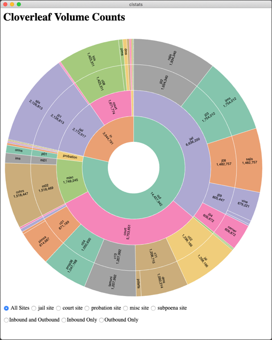

# Cloverleaf Volume Counts

This repository holds scripts used to visualize traffic volume through
the Cloverleaf integration broker that facilitates much of PIX.



The data passes through several stages before visualization.

1. The daily counts for Cloverleaf nodes are collected each night
   by a maintenance script just before these counts are reset for the
   next day.  The `hcimsiutil` command is used to fetch these counts.

2. The output from `hcimsiutil` is semi-structured text that must be
   parsed to extract the desired counts.  The nightly maintenance
   script does this by piping the `hcimsiutil` output through an `awk`
   script, which emits a single record with a timestamp, node name,
   and the daily count.  This single-line record is appended to a file
   named `/cis/local/log/traffic_YYYY-MM.txt`, where `YYYY` and `MM`
   are the current year and month, respectively.  A new file is
   started each month. Sample content is shown below.

```
2019-07-01 23:37:58 cchrs_misc_dest_out_p02 429
2019-07-01 23:37:58 dash_jail_dest_out_p02 853
2019-07-01 23:37:58 doj_probation_out_p02 742
2019-07-01 23:37:58 linx_jail_dest_out_p02 853
2019-07-01 23:37:58 jaims_probation_out_p03 0
```

3. The traffic file (from Step #2) is processed by a Python/Pandas script
   `monthlySummary.py` to aggregate the counts to a montly summary.
   Here is an invocation example.

   `python monthlySummary traffic_2019-07.txt`

   This creates a new file with a `.json` extension: `traffic_2019-07.json`.

4. The Electron application reads the JSON flat file and creates 
   treemaps and sunbursts.
